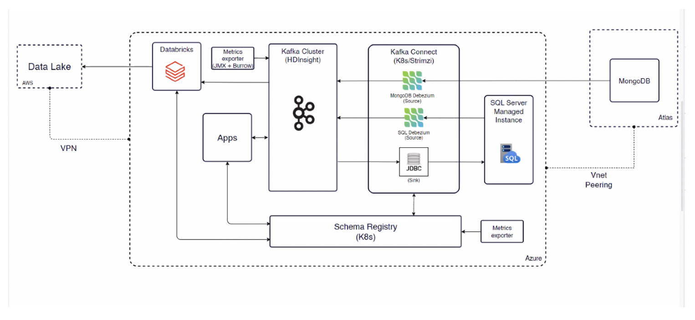
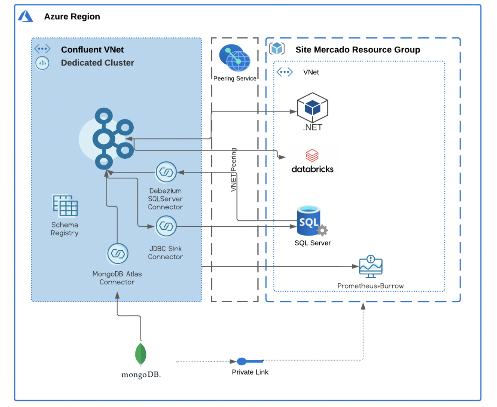

# Azure HD Insights to Confluent Cloud - Transactional and Analytics

In today's fast-paced business environment, companies rely heavily on technology to streamline their operations and stay ahead of the competition. One such company, ABC delivery, faced several challenges with their Kafka implementation on Azure HDInsights, including a lack of expertise and operational knowledge to maintain their Kafka environment. To overcome these challenges and ensure high availability and reliability for their core operations, they decided to migrate to Confluent Cloud, a managed Kafka solution that offers several features to support their business needs.
This demo walks you through migration process from OSK to Confluent Cloud , setting up Schema Registry to ensure data consistency and  connectors to connect source and sink.
You'll learn about:
- Migration from OSK to Confluent Cloud
- A fully managed Debezium SQL Server Connector (Source) , MongoDB Atlas Connector to stream database to Confluent Cloud
- JDBC Sink Connector to stream data from Confluent Cloud to database
- Schema Registry for data consistency
- .Net Kafka Client to integrate Confluent Cloud with their .Net applications.

## Architecture Diagram

### Existing Architecture

<div align="center"> 
  
</div>

#### Proposed Solution

<div align="center"> 
  
</div>

---

# Requirements

In order to successfully complete this demo you need to install few tools before getting started.

- If you don't have a Confluent Cloud account, sign up for a free trial [here](https://www.confluent.io/confluent-cloud/tryfree).
- Install Confluent Cloud CLI by following the instructions [here](https://docs.confluent.io/confluent-cli/current/install.html).
- An Azure Account with permissions to create resources, sign up for an account [here](https://azure.microsoft.com/).

## Prerequisites

### Confluent Cloud

1. Sign up for a Confluent Cloud account [here](https://www.confluent.io/get-started/).
1. After verifying your email address, access Confluent Cloud sign-in by navigating [here](https://confluent.cloud).
1. When provided with the _username_ and _password_ prompts, fill in your credentials.

   > **Note:** If you're logging in for the first time you will see a wizard that will walk you through the some tutorials. Minimize this as you will walk through these steps in this guide.

1. Create Confluent Cloud API keys by following [this](https://registry.terraform.io/providers/confluentinc/confluent/latest/docs/guides/sample-project#summary) guide.
   > **Note:** This is different than Kafka cluster API keys.

### Oracle Database

1. This demo uses an Oracle Standard Edition database hosted on AWS that is publicly accessible.

### MongoDB Atlas

1. Sign up for a free MongoDB Atlas account [here](https://www.mongodb.com/).

1. Create an API key pair so Terraform can create resources in the Atlas cluster. Follow the instructions [here](https://registry.terraform.io/providers/mongodb/mongodbatlas/latest/docs#configure-atlas-programmatic-access).

### Azure SQL

1. Sign up for a free Azure account [here](https://azure.microsoft.com/).

## Setup

## Connect MongoDB Atlas to Confluent Cloud

You can create the MongoDB Atlas Sink connector either through CLI or Confluent Cloud web UI.

<details>
    <summary><b>CLI</b></summary>

1. Run the following command to create the MongoDB Atlas Sink connector.

   ```bash
   confluent connect cluster create --config-file confluent/actual_mongodb_sink.json
   ```

</details>
<br>

<details>
    <summary><b>Confluent Cloud Web UI</b></summary>

1. On the navigation menu, select **Connectors** and **+ Add connector**.
1. In the search bar search for **MongoDB** and select the **MongoDB Atlas Sink** which is a fully-managed connector.
1. Create a new MongoDB Atlas Sink connector and complete the required fields using `actual_mongodb_sink.json` file.

</details>
<br>

Once the connector is in **Running** state navigate to **cloud.mongodb.com → Collections → demo-db-mod_FD_possible_stolen_card** and verify messages are showing up correctly.

Refer to our [documentation](https://docs.confluent.io/cloud/current/connectors/cc-mongo-db-sink.html) for detailed instructions about this connector.

## Confluent Cloud Stream Governance

Confluent offers data governance tools such as Stream Quality, Stream Catalog, and Stream Lineage in a package called Stream Governance. These features ensure your data is high quality, observable and discoverable. Learn more about **Stream Governance** [here](https://www.confluent.io/product/stream-governance/) and refer to the [docs](https://docs.confluent.io/cloud/current/stream-governance/overview.html) page for detailed information.

1.  Navigate to https://confluent.cloud
1.  Use the left hand-side menu and click on **Stream Lineage**.
    Stream lineage provides a graphical UI of the end to end flow of your data. Both from the a bird’s eye view and drill-down magnification for answering questions like:

    - Where did data come from?
    - Where is it going?
    - Where, when, and how was it transformed?

    In the bird's eye view you see how one stream feeds into another one. As your pipeline grows and becomes more complex, you can use Stream lineage to debug and see where things go wrong and break.

---

## CONGRATULATIONS

# Teardown

You want to delete any resources that were created during the demo so you don't incur additional charges.


# References

1. Database modernization with Confluent Cloud [blog](https://www.confluent.io/blog/cloud-data-migrations-database-modernization-with-confluent/)
2. Peering Connections in Confluent Cloud [doc](https://docs.confluent.io/cloud/current/networking/peering/index.html)
3. MongoDB Atlas Sink Connector for Confluent Cloud [doc](https://docs.confluent.io/cloud/current/connectors/cc-mongo-db-sink.html)
4. Stream Governance [page](https://www.confluent.io/product/stream-governance/) and [doc](https://docs.confluent.io/cloud/current/stream-governance/overview.html)
