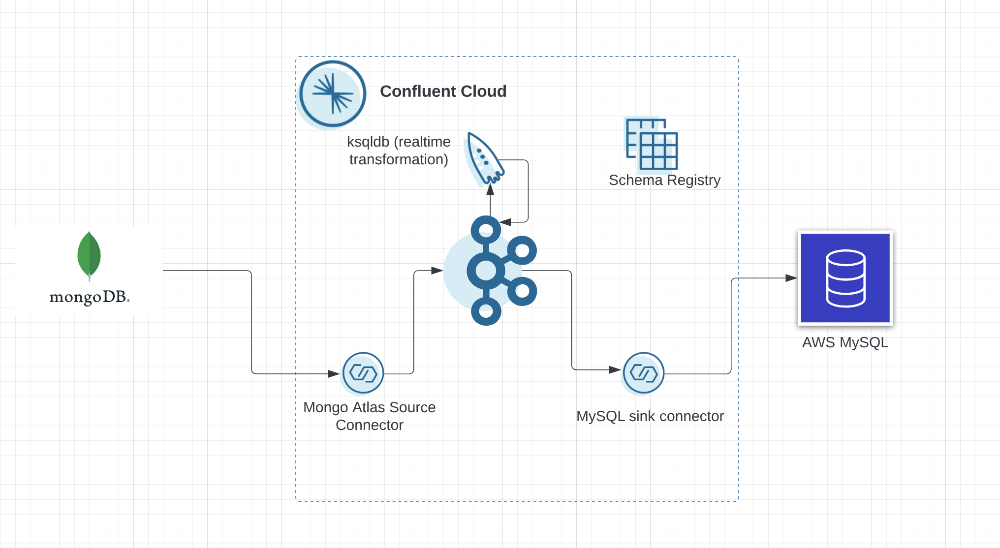
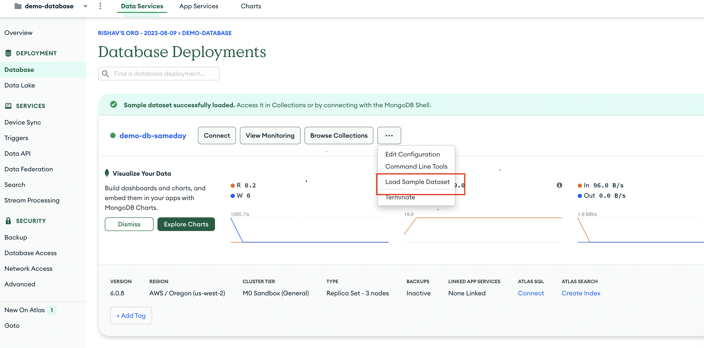
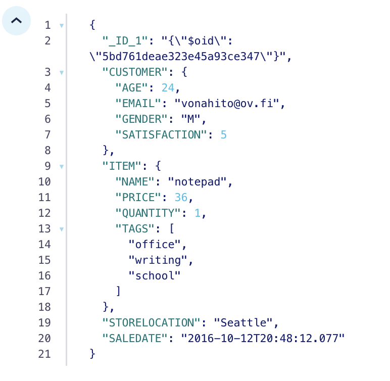
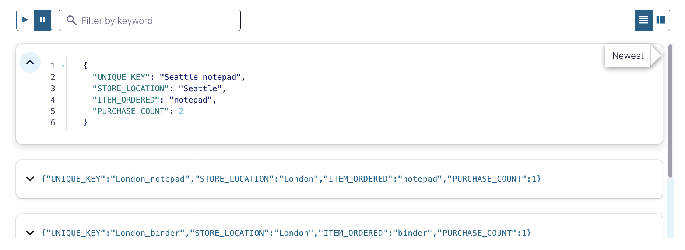
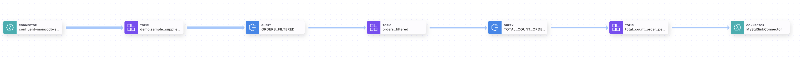

# Same Day Delivery

Today’s consumers expect their orders to be fulfilled rapidly. Retail giants like Amazon, Target, and Walmart all offer Same Day Delivery, and consumers now demand the same from other retailers; according to a recent study by McKinsey, 30% of consumers consider Same Day delivery as table stakes when making purchases online. 
To enable a reliable ‘Same Day Delivery’ service, however, delivery companies must implement a data infrastructure which seamlessly connects disparate systems – customer orders, vendor stock levels, and last-mile delivery platforms all need to work in tandem to ensure that items arrive with the consumer on time. 

## Challenges with Traditional Approaches:

Before turning to Confluent Cloud, this company had been relying on Apache Kafka in Azure HDInsight for core operations; it was powering everything from order and merchant updates to communication with delivery drivers. Despite playing such a central role in the business, however, their previous implementation presented a number of challenges. 

The main issue was that their team lacked the expertise required to maintain their Azure HDInsight implementation of Kafka. Without a fully-managed Kafka service, the team spent a significant amount of time troubleshooting. Ultimately, software upgrades and security patches were missed, and their streaming pipelines failed frequently – this led to outages in their delivery service, causing significant inconvenience to customers. 

In addition to this, their previous implementation of Kafka prevented them from innovating further with data streaming, while also taking up a substantial proportion of their operating budget. In their previous setup on Azure HDInsights (shown below), they lacked managed connectors – not only did this increase the maintenance burden on the infrastructure team, but also severely limited the possibility to sync data to other datastores used in the organization. On top of this, their previous platform didn’t offer any form of stream processing, making it more difficult to use their data streams for real-time use cases. Lastly, as Azure HDInsights is Hadoop-based, the team had to stand up, run, and pay for an entire Hadoop cluster in order to use Kafka – an extra burden and cost.

<b> This demo walks you through a streaming data pipeline where data originates from Mongodb , undergoes real-time processing in Confluent Cloud and gets sent to AWS MySQL. </b>

## Data Walkthrough

The source data in MongoDB comprises customer orders made at various store locations, and it undergoes real-time processing through ksqldb to derive and store the count of orders for each item at each store location in a ktable and then sent to an instance of MySQL running on AWS.

## Architecture Diagram

<div align="center"> 
  
</div>

---

# Requirements

In order to successfully complete this demo you need to install few tools before getting started.

- If you don't have a Confluent Cloud account, sign up for a free trial [here](https://www.confluent.io/confluent-cloud/tryfree).
- Install terraform by following the instructions [here](https://developer.hashicorp.com/terraform/tutorials/aws-get-started/install-cli).

## Prerequisites

### Confluent Cloud

1. Sign up for a Confluent Cloud account [here](https://www.confluent.io/get-started/).
1. After verifying your email address, access Confluent Cloud sign-in by navigating [here](https://confluent.cloud).
1. When provided with the _username_ and _password_ prompts, fill in your credentials.

   > **Note:** If you're logging in for the first time you will see a wizard that will walk you through the some tutorials. Minimize this as you will walk through these steps in this guide.

1. Create Confluent Cloud API keys by following [this](https://registry.terraform.io/providers/confluentinc/confluent/latest/docs/guides/sample-project#summary) guide.
   > **Note:** This is different than Kafka cluster API keys.

### MongoDB Atlas

1. Sign up for a free MongoDB Atlas account [here](https://www.mongodb.com/).

1. Create an API key pair so Terraform can create resources in the Atlas cluster. Follow the instructions [here](https://registry.terraform.io/providers/mongodb/mongodbatlas/latest/docs#configure-atlas-programmatic-access).

### AWS

1. Sign up for a free AWS account [here](https://aws.amazon.com/).

## Setup

1. This demo uses Terraform to spin up resources that are needed.
   
   Terraform spins up the following resources:
   
   1. Confluent Environment and Schema Registry
   2. Confluent Basic Cluster 
   3. Mongodb source connector
   4. Service accounts
   5. AWS MySQL

1. Clone and enter this repository.

   ```bash
   git clone https://github.com/K-rishav/Same-Day-Delivery.git
   cd Same-Day-Delivery
   ``` 

1. Edit the setup.properties file to manage all the values you'll need through the setup

1. Source the setup.properties file 

   ```bash
   source setup.properties
   ``` 

### Build your cloud infrastructure

1. Navigate to the repo's terraform directory.
   ```bash
   cd terraform
   ```
1. Log into your AWS account through command line.

1. Initialize Terraform within the directory.
   ```bash
   terraform init
   ```
1. Create the Terraform plan.
   ```bash
   terraform plan
   ```
1. Apply the plan to create the infrastructure.

   ```bash
   terraform apply
   ```
    > **Note:** Read the `main.tf` configuration file [to see what will be created](./terraform/main.tf).
1. Load the sample dataset in Mongodb database that is just created using terraform.
   
   <div align="center"> 
   
   </div> 

Hurray! Mongodb data is offloaded to Confluent topic. Thanks to Mongo Atlas Source Connector. Now let's setup MySQL Sink Connector.

---
## Enrich Data Streams with ksqlDB

Now that you have data flowing through Confluent, you can now easily build stream processing applications using ksqlDB. You are able to continuously transform, enrich, join, and aggregate your data using simple SQL syntax. You can gain value from your data directly from Confluent in real-time. Also, ksqlDB is a fully managed service within Confluent Cloud with a 99.9% uptime SLA. You can now focus on developing services and building your data pipeline while letting Confluent manage your resources for you.

<B>This section will involve the creation of a KStream and KTable that will calculate the number of orders from a particular store location using simple SQL like commands.</B>

If you’re interested in learning more about ksqlDB and the differences between streams and tables, I recommend reading these two blogs [here](https://www.confluent.io/blog/kafka-streams-tables-part-3-event-processing-fundamentals/) and [here](https://www.confluent.io/blog/how-real-time-stream-processing-works-with-ksqldb/).

1. On the navigation menu click on **ksqlDB** and step into the cluster you created during setup.
   To write streaming queries against topics, you will need to register the topics with ksqlDB as a stream or table.

2. **VERY IMPORTANT** -- at the bottom of the editor, set `auto.offset.reset` to `earliest`, or enter the statement:

   ```SQL
   SET 'auto.offset.reset' = 'earliest';
   ```

   If you use the default value of `latest`, then ksqlDB will read form the tail of the topics rather than the beginning, which means streams and tables won't have all the data you think they should.

3. Create a ksqlDB stream from `demo.sample_supplies.sales` topic.

   ```
   CREATE STREAM orders_raw 
   WITH(
   KAFKA_TOPIC='demo.sample_supplies.sales',
   VALUE_FORMAT='AVRO'
   );
   ```
4. Create another ksqlDB stream `orders_filtered` from `orders_raw` stream.

   ```
   CREATE STREAM orders_filtered 
   WITH (KAFKA_TOPIC='orders_filtered') as 
   SELECT fullDocument->_id,
   fullDocument->customer , 
   explode(fullDocument->items) as item,
   fullDocument->storelocation,
   fullDocument->saledate FROM orders_raw EMIT CHANGES;
   ```

   <div align="center"> 
  
</div>

5. Create `total_count_order_per_storelocation_per_item` table based on the `orders_filtered` stream you just created. The table is updated in real-time every time an order is placed. This table shows number of orders of a particular item from a particular store location.

   ```
   CREATE Table total_count_order_per_storelocation_per_item with (kafka_topic='total_count_order_per_storelocation_per_item_table',value_format='AVRO',key_format='AVRO') as
   SELECT concat(storelocation ,'_',item->name) as unique_key,
         LATEST_BY_OFFSET(storelocation) as store_location,
         LATEST_BY_OFFSET(item->name) as item_ordered,
         COUNT(*) AS purchase_count
   FROM orders_filtered
   where item->name is not null
   GROUP BY concat(storelocation ,'_',item->name)
   EMIT CHANGES;
   ```

6. Use the following statement to query `total_count_order_per_storelocation_per_item` table to ensure it's being populated correctly.

   ```SQL
   SELECT * FROM total_count_order_per_storelocation_per_item;
   ```

   Stop the running query by clicking on **Stop**.
<div align="center"> 
  
</div>

---

## Connect MySQL Sink to Confluent Cloud

You can create the MySQL Sink connector either through CLI or Confluent Cloud web UI.

<details>
    <summary><b>CLI</b></summary>

1. Run the following command to create the MySQL Sink connector.

   ```bash
   confluent connect cluster create --config-file confluent/connect_config.json
   ```

</details>
<br>

<details>
    <summary><b>Confluent Cloud Web UI</b></summary>

1. On the navigation menu, select **Connectors** and **+ Add connector**.
1. In the search bar search for **MySQL** and select the **MySQL Sink** which is a fully-managed connector.
1. Create a new MySQL Sink connector and complete the required fields.

</details>
<br>
<div align="center"> 
  
</div>
Once the connector is in **Running** state connect to MySQL and verify messages are showing up correctly.

Refer to our [documentation](https://docs.confluent.io/cloud/current/connectors/cc-mysql-sink.html) for detailed instructions about this connector.

## Confluent Cloud Stream Governance

Confluent offers data governance tools such as Stream Quality, Stream Catalog, and Stream Lineage in a package called Stream Governance. These features ensure your data is high quality, observable and discoverable. Learn more about **Stream Governance** [here](https://www.confluent.io/product/stream-governance/) and refer to the [docs](https://docs.confluent.io/cloud/current/stream-governance/overview.html) page for detailed information.

1.  Navigate to https://confluent.cloud
1.  Use the left hand-side menu and click on **Stream Lineage**.
    Stream lineage provides a graphical UI of the end to end flow of your data. Both from the a bird’s eye view and drill-down magnification for answering questions like:

    - Where did data come from?
    - Where is it going?
    - Where, when, and how was it transformed?

    In the bird's eye view you see how one stream feeds into another one. As your pipeline grows and becomes more complex, you can use Stream lineage to debug and see where things go wrong and break.

---
## CONGRATULATIONS

Congratulations on building your streaming data pipelines between cloud databases and cloud data warehouses for same-day delivery use case in Confluent Cloud! Your complete pipeline should resemble the following one.
<div align="center"> 
  
</div>


# Teardown

You want to delete any resources that were created during the demo so you don't incur additional charges.

   ```bash
   terraform destroy
   ```

# References

1. Peering Connections in Confluent Cloud [doc](https://docs.confluent.io/cloud/current/networking/peering/index.html)
2. MongoDB Atlas Sink Connector for Confluent Cloud [doc](https://docs.confluent.io/cloud/current/connectors/cc-mongo-db-sink.html)
3. AWS MySQL Sink [page](https://docs.confluent.io/cloud/current/connectors/cc-mysql-sink.html) 
